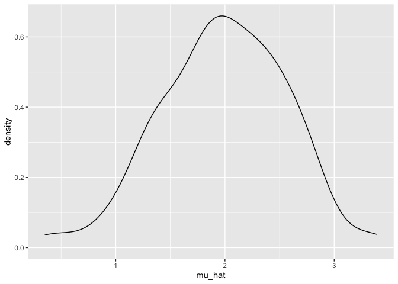
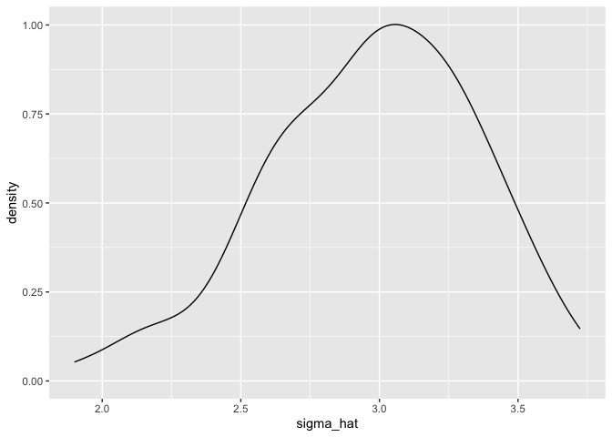
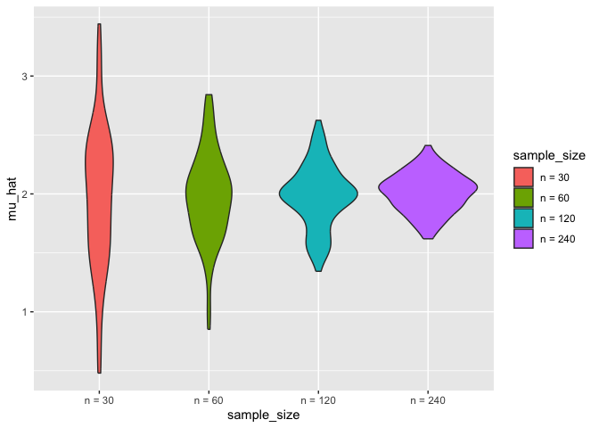

Simulation
================
Yaduo Wang
2023-11-12

``` r
library(tidyverse)
```

    ## ── Attaching core tidyverse packages ──────────────────────── tidyverse 2.0.0 ──
    ## ✔ dplyr     1.1.3     ✔ readr     2.1.4
    ## ✔ forcats   1.0.0     ✔ stringr   1.5.0
    ## ✔ ggplot2   3.4.3     ✔ tibble    3.2.1
    ## ✔ lubridate 1.9.2     ✔ tidyr     1.3.0
    ## ✔ purrr     1.0.2     
    ## ── Conflicts ────────────────────────────────────────── tidyverse_conflicts() ──
    ## ✖ dplyr::filter() masks stats::filter()
    ## ✖ dplyr::lag()    masks stats::lag()
    ## ℹ Use the conflicted package (<http://conflicted.r-lib.org/>) to force all conflicts to become errors

``` r
set.seed(1)
```

## Let’s similate something

I have a function take sample of size n from the population with mu and
sigma.

``` r
sim_mean_sd = function(n, mu = 2, sigma = 3) {
  
  sim_data = tibble(
    x = rnorm(n, mean = mu, sd = sigma),
  )
  
  sim_data |> 
    summarize(
      mu_hat = mean(x),
      sigma_hat = sd(x)
    )
}
sim_mean_sd(30)
```

    ## # A tibble: 1 × 2
    ##   mu_hat sigma_hat
    ##    <dbl>     <dbl>
    ## 1   2.25      2.77

## Let’s simulate a lot

Let’s start with a for loop. Repeat 100 times of the function and
generate a dataframe with 100 sample means and sample sd with sample 30
under the normal distribution with mean = 2 and sigma = 3.

``` r
#define an output.
output = vector("list", length = 100)

#
for (i in 1:100) {
  output[[i]] = sim_mean_sd(30)
  
}
bind_rows(output)
```

    ## # A tibble: 100 × 2
    ##    mu_hat sigma_hat
    ##     <dbl>     <dbl>
    ##  1   2.40      2.39
    ##  2   2.33      2.88
    ##  3   2.34      2.65
    ##  4   1.01      2.77
    ##  5   2.71      3.17
    ##  6   2.20      3.25
    ##  7   1.29      3.04
    ##  8   2.07      2.79
    ##  9   2.41      3.09
    ## 10   2.65      2.84
    ## # ℹ 90 more rows

Let’s use a loop function. generate the same results. Rerun the function
for 100 times and get 100 sample means and standard deviations.

``` r
sim_results = 
  rerun(100, sim_mean_sd(30)) |> 
  bind_rows()
```

    ## Warning: `rerun()` was deprecated in purrr 1.0.0.
    ## ℹ Please use `map()` instead.
    ##   # Previously
    ##   rerun(100, sim_mean_sd(30))
    ## 
    ##   # Now
    ##   map(1:100, ~ sim_mean_sd(30))
    ## This warning is displayed once every 8 hours.
    ## Call `lifecycle::last_lifecycle_warnings()` to see where this warning was
    ## generated.

Find the average and standard deviations for the 100 sample mean.

``` r
sim_results |> 
    ggplot(aes(x = mu_hat)) + 
  geom_density()
```

<!-- -->

``` r
sim_results |> 
    ggplot(aes(x = sigma_hat)) + 
  geom_density()
```

<!-- -->

``` r
sim_results |> 
  summarize(
    average_sample_mean = mean(mu_hat),
    sd_samp_mean = sd(mu_hat)
  )
```

    ## # A tibble: 1 × 2
    ##   average_sample_mean sd_samp_mean
    ##                 <dbl>        <dbl>
    ## 1                1.99        0.567

## Let’s try other sample sizes.

``` r
n_list = list(
  "n = 30" = 30,
  "n = 60" = 60,
  "n = 120" = 120,
  "n = 240" = 240
)

output = vector("list", 4)

# run every sample size for 100 times

for (i in 1:4){
  output[[i]] = rerun(100, sim_mean_sd(n = n_list[[i]])) |> 
    bind_rows()
}
```

    ## Warning: `rerun()` was deprecated in purrr 1.0.0.
    ## ℹ Please use `map()` instead.
    ##   # Previously
    ##   rerun(100, sim_mean_sd(n = n_list[[i]]))
    ## 
    ##   # Now
    ##   map(1:100, ~ sim_mean_sd(n = n_list[[i]]))
    ## This warning is displayed once every 8 hours.
    ## Call `lifecycle::last_lifecycle_warnings()` to see where this warning was
    ## generated.

``` r
## CONFUSE!!!
sim_result = 
  tibble(
  n = c(30, 60, 120, 240)
) |> 
  mutate(
    output_lists = map(.x = n, ~ rerun(100, sim_mean_sd(.x))),
    estimate_df = map(output_lists, bind_rows)
  ) |> 
  select(-output_lists) |> 
  unnest(estimate_df)
```

    ## Warning: There was 1 warning in `mutate()`.
    ## ℹ In argument: `output_lists = map(.x = n, ~rerun(100, sim_mean_sd(.x)))`.
    ## Caused by warning:
    ## ! `rerun()` was deprecated in purrr 1.0.0.
    ## ℹ Please use `map()` instead.
    ##   # Previously
    ##   rerun(100, sim_mean_sd(.x))
    ## 
    ##   # Now
    ##   map(1:100, ~ sim_mean_sd(.x))

``` r
sim_result |> 
  mutate(
    sample_size = str_c("n = ", n),
    sample_size = fct_inorder(sample_size)) |> 
  ggplot(aes(x = sample_size, y = mu_hat, fill = sample_size)) + 
  geom_violin()
```

<!-- -->

``` r
sim_result |> 
  group_by(n) |> 
  summarize(
    avg_sample_mean = mean(mu_hat),
    sd_samp_mean = sd(mu_hat)
  )
```

    ## # A tibble: 4 × 3
    ##       n avg_sample_mean sd_samp_mean
    ##   <dbl>           <dbl>        <dbl>
    ## 1    30            1.97        0.595
    ## 2    60            1.98        0.379
    ## 3   120            1.98        0.266
    ## 4   240            2.01        0.165
